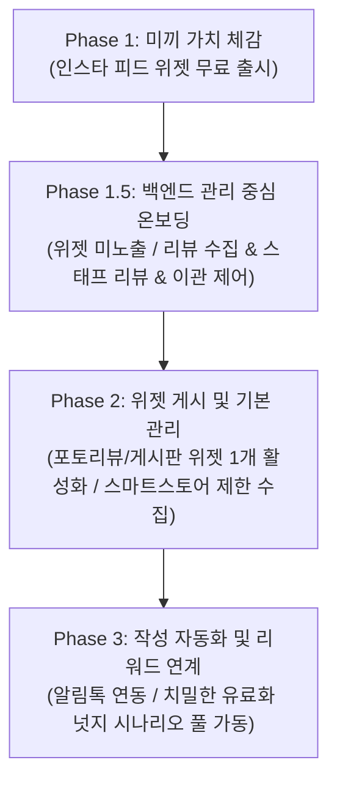

# 알파리뷰 무료 플랜 도입 및 구독 개편에 관한 종합 논의 (2026-05-21)

## 1. 배경 및 목적

### 도입 배경
1.  **알파앱스 통합 시너지**: 개별 분산된 알파 시리즈 앱들의 통합 과정에서 핵심적인 온보딩 주춧돌이자 핵심 재료로 동작합니다.
2.  **장기적 온보딩 가치**: 초기 쇼핑몰 운영자들의 자연스러운 유입 경로를 개설하고 제품 가치를 조기 체감하도록 지원합니다.
3.  **시장 장악 및 경쟁사 차단**: 무료 마케팅 허들을 대폭 낮춤으로써 후발 주자(리뷰에이드 등)의 신규 시장 진입을 원천 차단합니다.

### 기획 목적
1.  **Freemium 모델 실현**: 단순 미끼 기능에 그치지 않고, 고객사가 핵심 유료 플랜 기능을 영속적 또는 제한적으로 테스트할 수 있는 선순환 성장(PLG) 구조를 만듭니다.
2.  **비즈니스 건강성 획득**: 마케팅 비용보다 무료 플랜 운영 및 유지보수 비용이 적어야 한다는 비즈니스 원칙을 견지합니다.
3.  **에이전틱 알파앱스 연계**: 추후 자동화 에이전트 크레딧 모델 및 룰베이스 마케팅 자동화의 확장 단계까지 염두에 두고 구조를 설계합니다.

### 핵심 대전제: "무료의 궁극적 목표는 유료 전환이다"
*   **타겟 고객의 한정 (무료 자격 제한)**: "누구나" 쓸 수 있는 무분별한 무료가 아니라, **"향후 유료 고객으로 성장할 잠재력이 있는"** 초기 쇼핑몰 운영자로 수혜 대상을 좁힙니다.
    *   *선별 예시*: 신규 창업 및 PG 등록일로부터 12개월 이하인 초기 쇼핑몰.
    *   *작동 조건*: 비즈니스 의지가 있는 쇼핑몰이 리뷰 관리 솔루션의 절실함(시간 절약, 리뷰를 통한 매출 부스팅, SNS 마케팅 갈증)을 인지하게 만드는 최소 기능과 절대적 한도를 제공합니다.
    *   *다운그레이드 조건*: 월 주문 건수가 100건을 초과하는 즉시 기능이 점진적으로 다운그레이드 또는 제한됩니다.
*   **북극성 지표의 재정의**: 단순 가입자 수가 아닌 **"유료 플랜 가격 페이지 조회 수", "잠금 기능 클릭 횟수", "활성 사용자 중 유료 전환율"** 등 비즈니스 수익성과 밀접한 진짜 지표(North Star Metrics)를 트래킹하여 의사결정의 기반으로 삼습니다.

---

## 2. 무료 플랜 기능 명세 및 레버/제한 설계

### 기능 제한의 방식 (Levers)
1.  **기능 제한**: 핵심 기능만을 제공하는 화이트리스트 방식 적용.
2.  **사용 한도 제한 (Limit)**: 월간 또는 평생 사용 건수에 절댓값 한도를 지정. (예: 월 통합 한도 50건)
3.  **시간 조건**: 가입 기간 혹은 쇼핑몰의 연식 기준 필터링. (예: PG 등록일 기준 12개월 이하)
4.  **비금전 대가**: 신용카드 등록, 카카오 채널 등록 등을 무료 기능 해제 조건으로 부과하여 유료 전환 저항을 해소.

### 영역별 세부 상세 스펙

| 구분 | 세부 기능 및 항목 | 무료 플랜 제공 수준 및 제한 정책 |
|---|---|---|
| **작성 및 수집** | 이메일 리뷰 요청 | Phase 2 단계에서 추가 지원 예정. |
| | 알림톡 유도 수량 | **[방안 1]** 카드 등록 완료 시 월 50건 발송 권한 부여 (초과 시 건당 100원 부과. 유료 플랜은 건당 12원 적용. 초기 가입 시 3,000원 테스트 포인트 지급).  **[방안 2]** 누적 최대 요청 수 100건으로 절대 제한. |
| | 스태프 리뷰 | **[방안 1]** 월 20건 제한  **[방안 2]** 완전 미지원  **[방안 3]** 평생 총 100건으로 제한. |
| | **통합 횟수 제한** | **월 50건 통합 한도 적용 (카드 등록 필수)**  *대상*: 알림톡 유도 + 일반 리뷰 요청 + 스태프 리뷰 작성 + 소셜미디어(인스타/네이버 블로그) 가져오기 총합. |
| | 유도 기능 제한 세부 | 알림톡 & 메시지 설정 중 '첫 번째 리뷰 요청' 및 '채널 설정'만 제공. **회원가입 유도 알림톡 및 리뷰 작성 리마인더 발송 불가**.  텍스트 및 포토 리뷰 수집 양식만 사용 가능하며 기타 고도화 수집 양식은 비활성화. |
| **위젯 및 게시** | 위젯 세트 수 | **최대 1개**로 제한. |
| | 위젯 종류 | **포토리뷰 위젯, 평점 위젯, 게시판 리뷰 위젯**만 제공 (동영상 리뷰는 표시 불가 처리). |
| | 위젯 디자인 커스텀 | 공통 디자인 영역에서 **'기본 색상'**만 수정 허용.  리뷰 상세보기 화면 관련 세부 커스텀 기능은 전면 비활성화.  리뷰 작성 화면 중 '별점' 및 '포인트 컬러' 수정만 허용.  **'리뷰 작성 유도하기' 위젯 영역은 전면 사용 불가**. |
| | 레이아웃 제약 | 포토리뷰 위젯의 경우 **가로 배열 크기를 1개 열로 강제 고정** (구독 플랜 분기 기본값 설정 필요). |
| **리뷰 관리** | 리뷰 위치 선정 | 상단/하단 고정 기능 제공 여부에 대한 차등화 논의 중.  **[방안 1]** 상단/하단 수동 고정 기능은 무료 제공하되, 자동 지능형 관리는 유료 플랜 한정 제공.  **[방안 2]** 상하단 고정 완전 미지원.  **[방안 3]** 상단 혹은 하단 중 1개만 단방향 고정 지원. |
| | 리워드 및 포인트 | **포인트 자동 지급 기능 제한** (별점 및 키워드 기반 필터링은 가능하나 자동 포인트 리워드 지급은 불가 처리).  일반 리뷰 지급 포인트 설정 중 '별점/텍스트/포토' 기준 금액 수정만 가능하며 비회원 대상 리워드 지급 및 고도화 포인트 설정은 비활성화. |
| | 기타 관리 기능 | 리뷰 자동 댓글 작성 기능 불가.  리뷰 상품 간 연결(Cross-link) 1개로 제한.  리뷰 수동 게시/비게시 상태 변경 가능, 리뷰 기본 검색 필터링/키워드 매칭 기능 제공. |
| **추가 기능** | 인스타 피드 | 인스타 피드 위젯 연동 지원. |

---

## 3. 단계별 로드맵 (Phase Plan)

매우 높은 초기 리스크를 분산하고, 무료 사용자를 확실하게 유료 플랜으로 이끌기 위해 빌드 단계를 세밀하게 쪼개어 접근합니다.

### Phase 1: 미끼 수준 가치 제공
*   **핵심**: 인스타 피드 기능만을 독립시켜 무료 위젯 앱으로 별도 출시하여 초기 유행을 유도합니다.

### Phase 1.5: 관리 기능 및 제한적 백엔드 온보딩 (단기 마일스톤)
*   **핵심**: 쇼핑몰 전면 위젯 노출 없이도, 관리자가 유입되는 리뷰를 삭제하거나 우선순위를 조정할 수 있도록 지원합니다.
*   **기능 범위**: 
    1. 인스타 피드 위젯
    2. 재방문 배너 1종
    3. 수집 기능 3종 (알림톡 요청 시 카드 등록 필수, 스태프 리뷰 제한적 사용, 인스타/네이버 소셜미디어 수집)

### Phase 2: 게시 및 기본적인 관리 영역 허용
*   **핵심**: 쇼핑몰 전면에 게시판 위젯 및 포토리젯 위젯 1개를 부착할 수 있도록 허용합니다. (단, 포인트 지급 등 리워드 연동은 차단)
*   **기능 범위**: 포토리뷰 위젯 가로 배열 1개 고정 노출, 네이버 스마트스토어 연동(월 20건 제한).

### Phase 3: 작성 및 마케팅 루프 연계
*   **핵심**: 알림톡을 통한 리뷰 작성 유도 및 자동 리워드 지급 루프를 개방하며, **치밀하게 준비된 유료화 넛지 시나리오를 전면 가동**합니다.

---

## 4. 유료화 넛지 프레임워크 (4대 성장 동력)

레버를 이용해 인위적으로 사용을 막는 딱딱한 정책에서 탈피하여, 사용자 행동 심리학에 기반한 정밀한 시나리오 단위의 넛지(Nudge)를 배치합니다.

### 1축. 손실 현실화 (Loss Aversion)
> 사람은 동일한 크기의 이득보다 잃어버리는 손실에 약 2배 더 민감하게 반응합니다 (대니얼 카네만 교수 이론). 업그레이드를 포기함으로써 고객사가 직접 잃게 되는 기회비용을 계량적 수치로 가시화합니다.
*   **단계별 한계치 도달 경고**: 월 주문 100건 한도 도달 전 단계적으로 시각 알림을 배치합니다. (70건 도달 시 "한도 70% 소진", 90건 도달 시 "10건 잔여 경고", 100건 도달 시 "한도 초과로 인한 기능 축소 안내") 갑작스러운 완전 차단보다 점진적인 압박이 유료 결제 전환율을 혁신적으로 끌어올립니다.
*   **잠긴 기능에 "예상 비즈니스 효과" 노출**: 단순히 자물쇠 아이콘으로 기능을 잠그지 않고, **"AI 리뷰 답글 기능 사용 시 재구매율 평균 12% 향상 예상"**과 같은 구체적 데이터를 노출하여 "사용하지 않아 발생하는 기회 손실"을 명확히 인지시킵니다.
*   **미발송 리뷰 요청 및 기회비용 가시화**: 한도 부족으로 인해 자동 발송되지 못하고 소실된 리뷰 요청 건수를 표시합니다. (예: "이번 달 한도 제한으로 발송하지 못한 고객 리뷰 요청은 총 N건입니다. 발송했다면 예상 리뷰 X건 확보, Y원의 추가 매출 기여 기회를 잃었습니다.")

### 2축. 완성 충동 (Zeigarnik Effect)
> 완료되지 않은 작업이나 끊긴 맥락이 뇌리에 계속 남아 이를 기어이 해결하고 마무리 지으려는 미완성 효과를 활용합니다.
*   **4단계 온보딩 셋업 체크리스트**: 대시보드 진입 시 **"알파리뷰 100% 준비 완료까지 단 4단계 남았습니다"**라는 바 그래프를 상시 노출합니다.
    1.  쇼핑몰 위젯 설치 (즉시 적용)
    2.  첫 리뷰 수집 발송 템플릿 설정 (즉시 적용)
    3.  카카오톡 채널 연동 (마케팅 확보)
    4.  결제용 신용카드 등록 (최종 잠금 해제)
    *   *핵심 설계*: 가장 거부감이 높은 **신용카드 등록은 반드시 체크리스트의 제일 마지막 단계(4단계)에 배치**합니다. 앞선 1~3단계에서 위젯 설정의 가치를 확실히 체험하고 약 80% 이상의 진행률에 도달했을 때 사용자는 완성 충동을 강하게 느끼며 저항 없이 카드를 등록하게 됩니다.
*   **쇼핑몰 리뷰 준비도 점수화 (Score Card)**: 현재 쇼핑몰의 설정 완성 상태를 0점부터 100점까지 지표화하고, 동종 업계 평균 점수와 비교하여 행동을 촉발합니다. (예: "우리 쇼핑몰의 리뷰 준비도 40점 - 동종 업계 평균은 72점입니다. 카드 등록과 카카오 연동을 완료하고 평균 이상의 매출 부스팅을 확보하세요.")

### 3축. 습관 형성 (Habit Loop)
> 일상적인 쇼핑몰 운영 루틴 속에 알파리뷰 대시보드가 자연스럽게 스며들도록 고안하여, 제품 이탈 시 느낄 관리 공백을 극대화합니다. (가입 7일 차 리텐션 40% 이상 확보 목표)
*   **주간 성과 리포트 자동 발송**: 매주 월요일 아침, **"지난주 확보한 리뷰 N건 및 리뷰를 통한 구매 전환율 X%"** 정보를 메신저(카카오톡) 또는 이메일로 자동 송신하여 리포트를 주기적으로 확인하는 운영 습관을 길러줍니다. 리포트 하단부에는 미활성화 상태인 유료 기능의 맛보기 분석 리포트를 부분 노출합니다.
*   **실시간 리뷰 수집 알림**: 신규 리뷰가 등록될 때마다 슬랙 또는 앱 알림을 즉시 발송하여, 긍정적인 성취감 및 부정적 리뷰에 대한 즉각적 대응 욕구를 유도합니다.

### 4축. 사회 비교 (Social Proof)
> 다수 쇼핑몰의 평균 수치 및 상위 성공 지표를 노출하여 군중 심리를 유도하고 자극을 부여합니다.
*   **이 기능 사용 중인 실시간 쇼핑몰 수 노출**: 특정 잠금 기능 설명 옆에 **"현재 1,247개의 성장하는 쇼핑몰이 이 기능으로 리뷰를 극대화하고 있습니다"**라는 실제 통계를 실시간으로 표현하여 사회적 신뢰를 증명합니다.
*   **업종별 벤치마킹 갭 시각화**: 패션, 뷰티, 식품 등 쇼핑몰의 세부 도메인별 평균 리뷰 작성률을 대시보드 그래프에 오버레이합니다. (예: "패션 카테고리 평균 리뷰 전환율 4.8% - 우리 쇼핑몰은 현재 2.1%입니다. 리뷰 부스팅 기능을 활성화하여 격차를 좁혀보세요.")

---

## 5. 비상 대응 및 모니터링 프로토콜 (Emergency Protocol)

### 즉시 롤백(Rollback) 정책
무료화 플랜 출시 이후, 다음과 같은 비즈니스 지표 악화 또는 부작용이 발생할 경우 의사결정자는 수집된 지표를 기반으로 무료 플랜을 즉각 전면 취소하고 이전 정책으로 롤백합니다.
1.  **전환 파이프라인 불균형**: 신규 무료 가입자 수는 폭발하나, 기존 결제 고객이 대거 무료 플랜으로 하향 조정(체험/과금 -> 무료 플랜)하는 역효과 발생 시.
2.  **핵심 지표 급감**: 6주 동안의 신규 유료 체험 결제 건수가 **전월 대비 10% 이상 지속 감소**할 경우.
3.  **매출 손실 실현**: 전체 비즈니스 매출 규모가 **10% 이상 하락**하는 현상이 3개월간 검증될 경우.
*   *운영 프로토콜*: 매 2주마다 무료 플랜의 제한 임계치를 상향 조정 또는 기능 차단을 검토하는 긴급 지표 리뷰 회의를 수집 보고합니다.

### 제한 수준 상향 긴급 액션
이탈 방어에 실패하거나 트래픽 서버 비용 감당이 임계치를 초과할 시 아래의 긴급 패치를 즉각 적용합니다.
1.  **사용량 절댓값 제한**: 총 누적 리뷰 수집량이 한도에 달하면 추가 작성을 원천 차단.
2.  **수집 기능의 전면 동결**: 포토리뷰 작성 전면 불가 및 알림톡 발송 기능 즉각 차단.
3.  **설치비 정책 도입**: 무료 사용자가 솔루션 수동 설치/제거 지원 요청 시 **건당 55,000원의 수동 공임비**를 청구하여 CSM 리소스를 방어합니다.

---

## 6. 검증을 위한 12대 핵심 데이터 수집 가설

Phase 1.5 가동과 동시에, 무료 플랜의 비즈니스 타당성을 검증하기 위해 아래 12개 핵심 데이터를 집계할 수 있는 인프라를 구축해야 합니다.

1.  **데이터 1**: 플랜별 최근 30일/90일/360일 주문 수량의 평균값 및 중간값 (무료 플랜의 월 주문 100건 한도의 정당성 검증용).
2.  **데이터 2**: 플랜별 평균 쇼핑몰 존속 기간 및 해당 기간 평균 주문량 트렌드.
3.  **데이터 3**: 각 플랜별 고객 리뷰 작성률 대비 빠른 리뷰 기능 사용 여부 크로스 분석.
4.  **데이터 4**: 플랜별 가입 전체 기간 대비 작성된 스태프 리뷰 수량 누적 추이.
5.  **데이터 5**: 무료 플랜 사용 고객사의 통합 횟수 제한(월 50건) 실제 도달 분포 및 평균 도달 속도.
6.  **데이터 6**: 플랜별 리뷰 상/하단 고정 기능의 평균 설정 빈도.
7.  **데이터 7**: 활성화된 상품 리뷰 연결(Cross-link)의 개수 분포.
8.  **데이터 8**: 무료 가입 이후 유료 플랜 가격 안내 및 비교 페이지 실제 조회 유도 수 (전환 퍼널 최상단).
9.  **데이터 9**: 비즈니스 규모별 이탈(Churn) 고객사의 연도별/월별 누적 추세 트렌드 (최근 3개년).
10. **데이터 10**: 결제 금액(주문건 10건, 50건, 100건 이하 단위)에 따른 서버 트래픽 비용 및 인프라 비용 역산 테이블.
11. **데이터 11**: 무료 플랜 내 알림톡 발송 실제 건수 및 포인트 소진 속도.
12. **데이터 12**: 신규 설치 요청 접수 후 완료까지 소요되는 CSM 실무 리소스 투입량 및 발생 원인 유형 분석.
