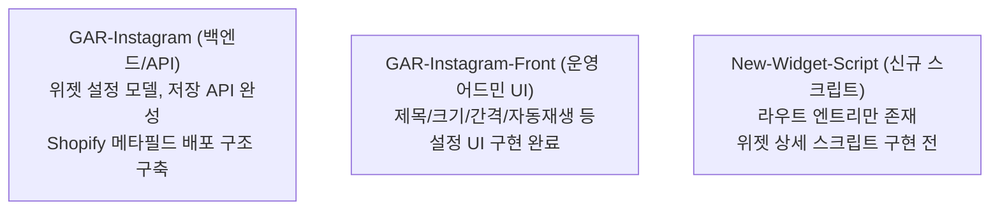

# 인스타피드앱 기본 설정 및 저장소별 구현 현황 분석 (REVW-497)

본 문서는 인스타피드 위젯 출시와 관련하여 마케팅팀의 요건을 토대로 소스 코드 및 저장소 인텔리전스를 통해 실제 구현 현황과 세부 설정 명세를 대조 분석한 리포트입니다.

---

## 1. 인스타피드 위젯의 핵심 목적

*   **비즈니스 핵심 가치**: "인스타그램 콘텐츠를 쇼핑 가능한(Shoppable) 형태로 사이트 전면에 매끄럽게 노출하는 것"
*   **기대 효과**: 브랜드의 활성도(최신성) 및 신뢰도를 증명하고, 게시물 내부의 영역에 상응하는 실시간 Shopify 상품 정보를 매핑 매칭함으로써 사이트 구매 전환율을 극대화합니다.

---

## 2. 세부 기능 명세 (Feature Specifications)

### 기본 표시 및 레이아웃
*   **비주얼 테마**: 위젯 제목, 폰트 글자 크기, 테두리 레이아웃, 노출 간격 커스터마이징.
*   **그리드 제약**: 화면 규격에 따른 행(Row) 및 열(Column) 개수 조정.

### 콘텐츠 동작 정책
*   **미디어 컨트롤**: 영상 게시물의 자동 재생(Autoplay) 여부 온/오프 제어.

### 게시물 상세 정보 노출 옵션
*   소셜 인터랙션 수치 표시 여부 (인스타그램 계정 팔로워 수, 게시물별 좋아요 수, 댓글 수).
*   **상품 연결**: 게시물 하단에 연결된 상품 정보를 표시할지 결정. (게시물 1개당 **Shopify 상품은 최대 5개까지** 연동이 가능한 데이터 흐름이 식별됨)

### 콘텐츠 및 게시물 관리 (운영 어드민)
*   **게시 처리**: 특정 인스타 피드 게시물을 개별 혹은 벌크로 노출(Publish) 또는 미노출(Unpublish) 처리.
*   **검색 필터**: 본문 캡션(Caption) 문자열 매칭 및 공개 여부 기준 필터링.
*   **동기화**: 인스타그램 원본 게시물 최신 데이터 수동/자동 리프레시 기능.
*   **상품 관리**: 개별 게시물에 Shopify 상품을 유동적으로 바인딩 및 해제 처리.

---

## 3. 저장소별 구현 성숙도 분석 (Repository Status)

### 1) GAR-Instagram (백엔드 및 API 엔진)
*   **성숙도**: **상 (Complete)**
*   **구현 현황**: 인스타피드 설정을 제어하는 위젯 스펙 모델(Model)과 설정 데이터를 저장/조회하는 백엔드 API가 완성되어 있습니다.
*   **배포 방식**: 위젯 구동에 필요한 HTML, CSS, Javascript 리소스를 Shopify 메타필드(Metafield) 시스템에 직접 적재하여 클라이언트로 즉시 퍼블리싱하는 배포 메커니즘이 확립되어 있습니다.

### 2) GAR-Instagram-Front (운영 어드민 어플리케이션)
*   **성숙도**: **상 (Complete)**
*   **구현 현황**: 일반 관리자 쇼핑몰 운영자가 조작하는 실제 어드민 설정 콘솔 UI가 마크업 및 비즈니스 로직과 함께 안정적으로 개발되어 있습니다. 
*   *UI 컨트롤 범위*: 타이틀, 글자 폰트 사이즈, 피드 간 간격 및 간격 레이아웃, 행렬 구성, 영상 자동재생 유무, 팔로워 및 좋아요 수 표시 제어가 가능합니다.

### 3) New-Widget-Script (통합 신규 스크립트 엔진)
*   **성숙도**: **하 (Pending)**
*   **구현 현황**: 인스타피드 위젯 연동을 위한 기본적인 라우팅 경로 세그먼트와 진입을 위한 부트스트랩 엔트리 포인트(Entry Point)만 정의되어 있으며, **실제 클라이언트 사이드에서 작동하는 피드 렌더링 스크립트 및 세부 파라미터 처리 코드는 누락된 미구현 상태**입니다.

---

## 4. 최종 분석 결론

현재 백엔드(GAR-Instagram)와 어드민 UI(GAR-Instagram-Front)는 인스타피드를 쇼핑몰 관리자가 손쉽게 다룰 수 있도록 핵심 기반 설계가 우수하게 구비되어 있습니다. 
따라서 향후 프로젝트 실무 과제는 **`New-Widget-Script` 저장소 내부에 실제 프론트 클라이언트 위젯 렌더러와 데이터 파싱 스크립트를 구현 및 보완하는 작업**에 초점을 맞추어야 합니다.
